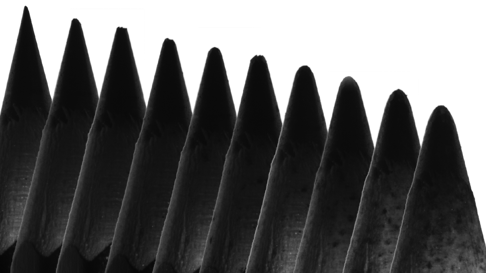

[//]: # (Universal_Shape_of_Pointed_Tips)

### SciComm resources accompanying 

***"The geometry of Nature's stingers is universal due to stochastic mechanical wear", John Sebastian and Kaare H Jensen, PNAS 2026***.

# Summary
📰 New findings from our lab!

Sharp, spine-like structures, or stingers, appear across nature in creatures as diverse as tiny zooplankton, honeybees, elephants, and narwhals. These pointed shapes are often cited as an example of convergent evolution: different species independently arriving at similar solutions. In this case, it’s a simple yet effective defence mechanism - stinging or piercing. The simplest shape one might imagine for such a weapon would be a conical tip, which is the most common choice for man-made axisymmetric polearms. However, biological stingers,  though conical overall, universally possess a specific rounded tip, namely a paraboloid, expressed as z~radius^2.

So why do all stingers posses this shape across taxonomical lineages regardless of organismal size? In 2024, Quan et al. (PNAS) argued it’s down to evolutionary selection pressures favouring efficient penetration into soft tissues. But here’s the twist: if one observes a newly formed stinger that has never been used, it does not necessarily have the universal tip shape! But observe it again at a later stage in the organism’s life, it would be found to posses the paraboloid tip profile. And observe it again later - no surprises - another blunted paraboloid with the same mathematical expression! The mechanism at play here is one that we all know, but are rarely aware of: random mechanical wear. To explore this idea, we used pencils as biomimetic stingers, exposing them to stochastic collisions and vibrations. What we found was that sequential weathering of material progresses in a way such that any conical object will eventually have its tip worn to the most stable shape - the paraboloid. The reason for its universality is neither biological function nor evolutionary optimisation, it is merely the commonality of the underlying physical phenomena - material removal by inevitable wear.

  

  

# The story
A brief stroll through the museum halls suffices to discern the prevalence of polearms in the history of
human weaponry. A shorter walk in a garden is perhaps adequate to notice that the case is no different
in Nature. Stingers – pointed appendages – are widespread in organisms across different branches of
the tree of life, from tiny zooplankton to the familiar bee to the mighty narwhal. Often cited as an example
of convergent evolution, biological stingers are believed to have evolved independently across species -
a simple yet efficient defence strategy. Remarkably, the commonalities do not end there. At first glance,
most stinger tips may appear to be a regular cone. But zoom in and take a closer look - you’d see a
rounded tip. Not a sharp “spinose" tip that we may intuitively attribute to a weapon. In a 2024 study,
Quan et al. (PNAS)[1] reported that regardless of organismic size or the material the stingers are made
of, the rounded tip follows the expression z ∼ radiusn with n ≈ 2. This means that if one looked at the
outline of the stinger tip, it would the humble parabola! But why is this so? Quan et al. argued that the
paraboloid tip shape results from evolutionary pressures selecting the optimal shape suited for piercing
into soft tissues, without buckling or bending instantly before any damage can be made. However, they
also showed through experiments that tip shapes with n lying between 2 and 6 are equally suitable
shapes where piercing outcompetes buckling. Then, of all suitable shapes, why do biological stingers
universally possess the parabolic profile or n ≈ 2? If evolutionary selection is at play, are stingers ‘born’
with this shape?

Coming from fluid mechanics, this was not the first time we encountered parabolic tip shapes in the
literature. For example, the tip of icicles which are shaped by the physics of melting[2], the apex of a
cylinder of sugar melting in a tank of water shaped by flow driven by dissolution[3], are both paraboloid.
What if the stingers are also shaped by some erosive mechanism, where material is removed rather
than added? To verify this notion, we decided to look for newly formed stingers. Unsurprisingly perhaps,
finding well preserved stingers that have never been used turned out to be quite the ordeal. Fortunately,
around the same time Ryderheim et al. (PNAS 2024)[4] published images of the microscopic mandibles
of larval copepods – of pristine, unused marine ‘teeth’ and those of used mandibles later in their lifetime.
These newly minted stinger tips were sharp “spinose" cones, whereas the used stingers were reminiscent
of the universal parabolic geometry. This observation affirmed our hypothesis that the universality of
stinger shapes stem not from a biological driver, rather, it is simply geometry and mechanics at play.

To validate our idea, we used pencil tips as stand-ins for their biological counterparts, simulating
mechanical interactions by placing them on a vibrating plate, allowing them to collide with one another
stochastically. After tracking the change in their geometries for about four and a half hours, we found that
pencils of different grades (that is, with different material properties) and of different initial shapes (the tip
does not have to be well-sharpened, or could even be broken) all morphed over a few hours of collisional
activity. In addition to control experiments in the lab, we were amused enough to put sharpened pencils
in a little box and carry it around in our pockets as we’d walk around for several days! The pencils would
audibly rattle around, and took merely 20k steps to start conforming to the expression for the universal
paraboloid.

The relation between form and function has long inspired scientists from various disciplines. And it
is quite compelling to take a functional view of surprising commonalities in Nature. However, the forma-
tion or development of shapes in biology is both driven by and limited by underlying physical principles
rather than an end-use function. The emergence of a universal geometry as an inevitable mechanical
consequence of use, which coincidentally takes the guise of an optimized shape, offers a cautionary tale
in biomimetics and suggests that temporal stochastic processes may play a more fundamental role in
shaping form in Nature than adaptive narratives alone would imply.

[PDF](./pointyThings_SciComm_summary.pdf)

## References

[1] Quan, H.; Liang, X.; Zhang, X.; Meyers, M. A.; McMeeking, R. M.; Arzt, E. Proceedings of the National Academy of Sciences 2024, 121, e2316320121.

[2] Huang, J. M.; Moore, M. N. J.; Ristroph, L. Journal of Fluid Mechanics 2015, 765, R3.

[3] Nakouzi, E.; Goldstein, R. E.; Steinbock, O. Langmuir 2015, 31, 4145–4150.

[4] Ryderheim, F.; Olesen, J.; Kiørboe, T. Proceedings of the National Academy of Sciences 2024, 121, e2407876121. 

# Media
[Images](./images/)

## Contact
+ Kaare H. Jensen, Department of Physics, Technical University of Denmark

  Email: khjensen@fysik.dtu.dk 

  Phone: +45 2231 5241

+ John Sebastian, Department of Physics, Technical University of Denmark

  Email: johnseb@dtu.dk

  Web: [john-seb.github.io](https://john-seb.github.io/)
